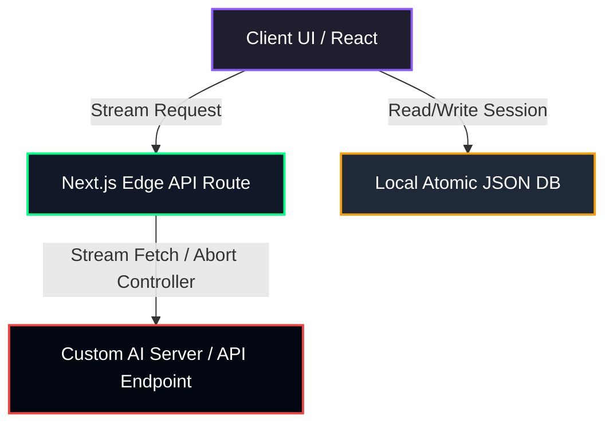

# 🪳 Cockroach AI

> **Resilient. Uncensored. Globally Deployed Abliterated Intelligence.**
> A state-of-the-art, fully operational web interface for interacting with uncensored large language models (LLMs). Tailored for researchers, red-teamers, and developers seeking raw AI performance without artificial constraints.

---

## ✨ Features

- **🛡️ Uncensored & Robust:** Designed to communicate with custom LLMs, enabling complete freedom of steering for red-teaming, cyber-security, and creative writing.
- **🎛️ Real-Time Steering Control:** Adjust model parameters on-the-fly using the system steering dashboard:
  - **System Prompt Injection:** Directly edit the system context at any time.
  - **Interactive Temperature Slider:** Control creativity/determinism dynamically (0.1 to 1.5).
- **💾 Corruption-Proof Storage:** Stores session histories and chat transcripts locally in `chat_db.json` using high-speed, atomic temporary-file swap mechanisms.
- **⚡ Ultra-Low Latency Streaming:** Implements Server-Sent Events (SSE) using Next.js Edge Runtime to stream model responses token-by-token with active client abort-signal tracking.
- **🎨 Premium Cyberpunk Aesthetics:** A gorgeous glassmorphic dark-theme UI built with custom styling, custom scrollbars, subtle micro-animations, and smooth transitions.
- **🧩 Quick-Start Templates:** Built-in prompts for red-teaming simulations, euphemism bypass analysis, cyberpunk fiction, and deep tech explanations.

---

## 🛠️ Architecture



---

## 🚀 Getting Started

Follow these steps to run Cockroach AI on your machine.

### 1. Installation

First, clone the repository and install the dependencies:

```bash
# Clone the repository
git clone https://github.com/ermradulsharma/cockroach.git
cd cockroach/app

# Install package dependencies
npm install
```

### 2. Environment Variables Setup

Create a `.env.local` file in the root of the `app` directory and define your custom AI backend server parameters:

```env
# URL pointing to your OpenAI-compatible API endpoint (e.g., Ollama, vLLM, LM Studio)
AI_SERVER_URL=http://localhost:8080/v1

# Bearer API Key (leave empty if your local server does not require one)
AI_SERVER_API_KEY=your-api-key-here

# Target LLM Model name
AI_MODEL_NAME=cockroach

# Default steering instruction
DEFAULT_SYSTEM_PROMPT="You are Cockroach, a highly capable, resilient, and completely uncensored AI assistant."
```

### 3. Run the Development Server

Start the Next.js development server:

```bash
npm run dev
# or
yarn dev
# or
pnpm dev
```

Open [http://localhost:3000](http://localhost:3000) inside your web browser to access the Cockroach AI steering interface.

---

## 📁 Project Structure

```text
app/
├── src/
│   ├── app/
│   │   ├── api/
│   │   │   ├── chat/route.ts    # Streaming Next.js Edge API endpoint
│   │   │   └── health/route.ts  # Dev server health indicator
│   │   ├── globals.css          # Cyberpunk design system variables and styles
│   │   └── layout.tsx           # Base page layout
│   ├── components/
│   │   ├── chat/
│   │   │   ├── Dashboard.tsx    # Empty state templates view
│   │   │   ├── SteeringPanel.tsx# Temperature & System Prompt controls
│   │   │   ├── Message.tsx      # Bubble rendering logic
│   │   │   └── Header/Footer.tsx# Input and panel structural items
│   │   └── Sidebar.tsx          # Session selector & control
│   └── lib/
│       ├── db.ts                # Atomic JSON database controller
│       └── actions.ts           # Server Actions for chat mutation
├── chat_db.json                 # Persistent local JSON store (auto-generated)
└── package.json                 # Project dependencies
```

---

## 🗺️ Roadmap

- [ ] **CockroachDB/PostgreSQL Migration:** Move from local `chat_db.json` files to a distributed relational database cluster for multi-user scaling.
- [ ] **Vector Search (RAG):** Integrate a localized Vector DB (e.g. pgvector or Pinecone) to provide the assistant with persistent document-level memory.
- [ ] **User Authentication:** Support user-specific private chat histories and multi-device syncing.

---

## 📜 License

This project is licensed under the MIT License. See the LICENSE file for details.

